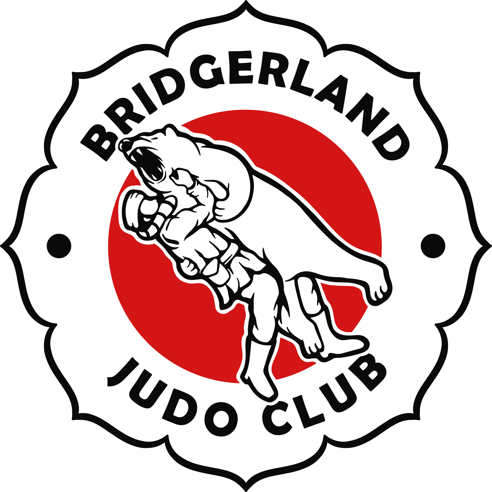
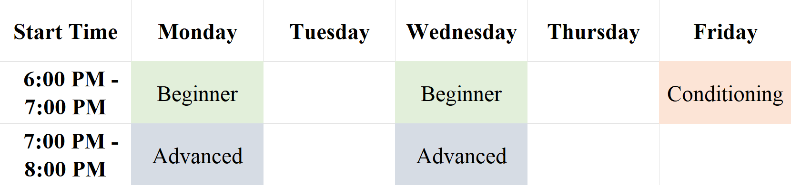

---
> ## About Us
Welcome to Bridgerland Judo Club, a community-centered martial arts organization dedicated to promoting the sport of Judo in a safe and welcoming environment. Our club is committed to providing a supportive and inclusive space for individuals of all skill levels to learn, grow, and succeed!  
 
At Bridgerland Judo Club, we pride ourselves on our team of highly qualified and dedicated instructors. Our instructors are SafeSport certified and are passionate about sharing their knowledge and experience with others. We believe that Judo is more than just a sport; it's a way of life. We are committed to fostering a sense of community and camaraderie among our members.

> ## Class Times
Classes will be held on Mondays and Wednesdays with a conditioning class on Fridays.  
**Kids:** (ages 5 to 12) 5 pm - 6 pm  
**Beginner:** 6 pm - 7 pm  
**Advanced:** 7 pm - 8 pm  
**Friday Conditioning:** 6 pm - 7 pm

--- 
> ## Instructors

  <em> Sensei Sarah Shaw </em> 

  * Sarah is a distinguished Judo Sensei and USA Judo recognized Black belt, with over a decade of experience in the sport.
  * She has made significant contributions to the Judo community, both as an instructor and a regional referee.
  * Sarah has taught Judo at Utah State University, where she has helped many students develop a passion for the sport.
  
> ### Sensei Cal Baker

  * Cal Baker is a dedicated Judo practitioner with 9 years of experience in the sport. 
  * He is a skilled instructor who has taught Judo at Utah State University and a proud silver medalist in the Intermountain States Judo Tournament. 
  * Cal is passionate about sharing his knowledge and love for Judo with others, and his dedication to teaching inspires his students to achieve their goals.
  
> ### Sensei Anthony Shaw

  * Anthony is an elite Judo athlete who achieved national recognition as the number 2 IJF super heavyweight in the United States.
  * He has represented his country with distinction in the 2022 Pan-American games.
  * With a formidable record of victories, Anthony has proven himself to be a true force in the Judo world.

---
> ## Pricing

---
> ## Contact Us
**Instagram/Facebook:** [@bridgerland_judo_club](https://www.instagram.com/bridgerland_judo_club)   
**Email:** Bridgerlandjudo@gmail.com  
**Location:** Whittier Community Center, Room 5 (*290 N 400 E, Logan, UT 84321*)
